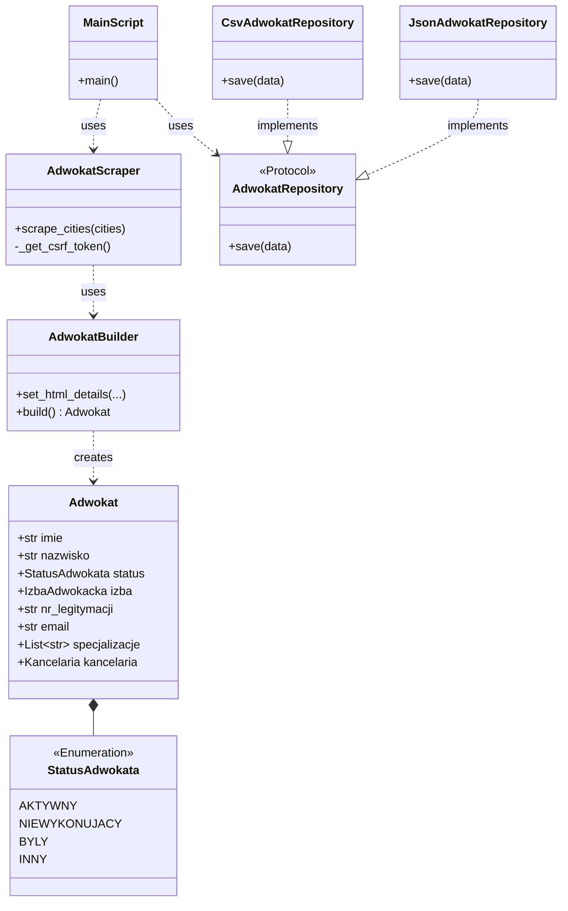

# Adwokat Scraper 🕷️⚖️

Projekt zaliczeniowy z przedmiotu **Zaawansowane programowanie w Pythonie**.
Aplikacja jest asynchronicznym scraperem danych ze strony [rejestradwokatow.pl](https://www.rejestradwokatow.pl/adwokat). Pobiera dane adwokatów (dane osobowe, status, email, kancelaria, specjalizacje) z wybranych miejscowości i zapisuje je w ustrukturyzowanej formie (JSON/CSV).

## 🏆 Realizacja Kryteriów Oceny

Projekt spełnia wszystkie wymagania podstawowe oraz dodatkowe:

*   ✅ **Dataclasses:** Modele danych w `src/domain.py` wykorzystują `@dataclass`.
*   ✅ **Async/Multithreading:** Wykorzystanie `asyncio`, `aiohttp` oraz `asyncio.Semaphore` do równoległego pobierania danych bez blokowania I/O.
*   ✅ **Wzorce Projektowe / SOLID:**
    *   **Builder:** Oddzielenie logiki parsowania HTML od modelu danych (`AdwokatBuilder`).
    *   **Repository/Strategy:** Abstrakcja zapisu danych (`JsonAdwokatRepository`, `CsvAdwokatRepository`) zgodna z Zasadą Odwrócenia Zależności (DIP).
*   ✅ **Testy Jednostkowe:** Testy w `pytest` pokrywające logikę domeny, parsowanie HTML (Builder) oraz zapis plików.
*   ✅ **Typowanie:** Pełne wykorzystanie Type Hints oraz walidacja statyczna (projekt przechodzi sprawdzanie przez `basedpyright`).
*   ✅ **Bonus: Enum:** `StatusAdwokata` dziedziczący po `str` i `Enum` do bezpiecznego mapowania statusów.
*   ✅ **Bonus: Pydantic:** Wykorzystanie `pydantic.dataclasses` do walidacji danych wejściowych.

## 🛠️ Technologie

*   **Python 3.12+**
*   **uv** - nowoczesny menedżer pakietów.
*   **aiohttp** - asynchroniczne zapytania HTTP.
*   **BeautifulSoup4** - parsowanie HTML.
*   **Pydantic** - walidacja danych.
*   **Pytest** - testy jednostkowe.

## 🚀 Instalacja i Uruchomienie

Projekt wykorzystuje `uv` do zarządzania zależnościami, ale można go uruchomić również standardowym `pip`.

### Opcja A: Używając `uv` (Zalecane)

1.  Zainstaluj zależności:
    ```bash
    uv sync
    ```
2.  Uruchom scraper:
    ```bash
    uv run main.py
    ```

### Opcja B: Używając standardowego `pip`

1.  Zainstaluj zależności:
    ```bash
    pip install aiohttp beautifulsoup4 pydantic pytest
    ```
2.  Uruchom scraper:
    ```bash
    python main.py
    ```

## 🏗️ Architektura i Diagram Klas

Projekt został zaprojektowany zgodnie z zasadami **SOLID**. Kluczowe elementy architektury:

*   **Scraper Engine:** Zarządza sesją HTTP, tokenami CSRF (Reverse Engineering mechanizmu anty-botowego) i współbieżnością.
*   **Builder:** Odpowiada za "wyciąganie" danych z brudnego kodu HTML.
*   **Repository:** Odpowiada za zapis danych. `Main` zależy od interfejsu (Protokołu), a nie od konkretnej implementacji (JSON/CSV).



Aby uruchomić testy:
```bash
uv run pytest
```

Struktura projektu:
```bash
.
├── src/
│   ├── domain.py          # Modele danych (Pydantic Dataclasses)
│   ├── storage.py         # Wzorzec Repository (JSON/CSV)
│   └── scraper/
│       ├── builder.py     # Parsowanie HTML (Builder Pattern)
│       └── engine.py      # Logika sieciowa (AsyncIO, aiohttp)
├── tests/                 # Testy jednostkowe
├── main.py                # Punkt wejścia (Entry Point)
├── pyproject.toml         # Konfiguracja projektu i lintera
└── README.md              # Dokumentacja
```